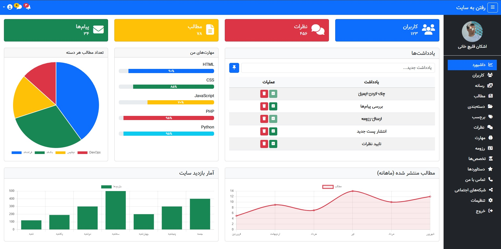
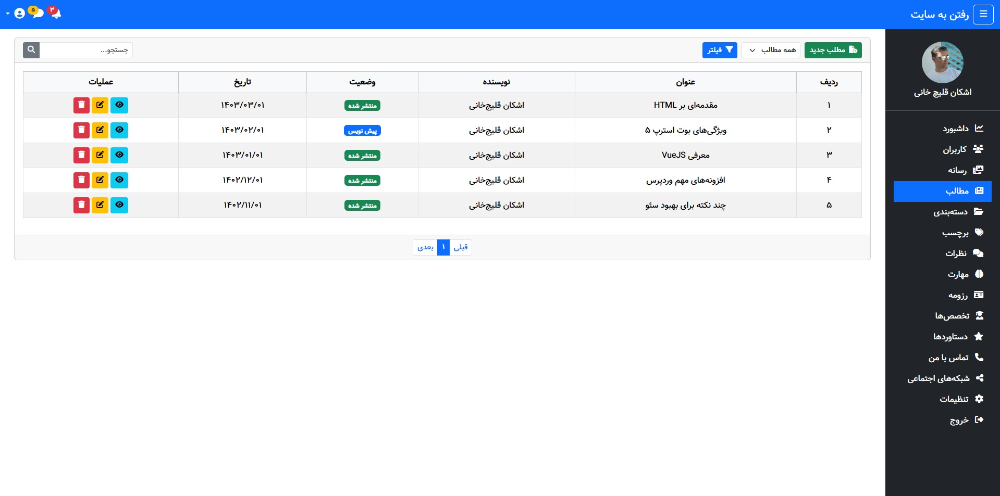

# قالب پنل مدیریت شخصی

این قالب پنل مدیریت مناسب سایت‌های شخصی و رزومه‌ای است که با استفاده از تکنولوژی‌های زیر طراحی شده:

- **Bootstrap 5.2.3 RTL**
- **FontAwesome 6**
- **Chart.js**
- **Vazir font**

## ویژگی‌ها

- طراحی واکنش‌گرا (Responsive)
- پشتیبانی از زبان فارسی و راست‌چین (RTL)
- چارت‌های آماری زیبا
- یادداشت‌برداری داخلی
- ناوبری ساده و قابل شخصی‌سازی

## پیش‌نمایش

  

## روش استفاده

فایل `index.html` را در مرورگر خود باز کنید. همه فایل‌ها به‌صورت لوکال کار می‌کنند.
به دلیل استفاده از cdn، اتصال به اینترنت نیاز است.

## مجوز

این پروژه تحت مجوز MIT منتشر شده است. توضیحات کامل در فایل [LICENSE](./LICENSE) آمده است.
